  <picture>
    <source media="(prefers-color-scheme: dark)" srcset="./header-dark.svg">
    <source media="(prefers-color-scheme: light)" srcset="./header.svg" />
    
  </picture>

  

  <b>Full Stack Software Engineer @ Resilient Technologies Ltd</b>  
   Passionate about building scalable, meaningful products using logic, collaboration & AI-enabled tech.

  

&nbsp;

## 🔥 Featured Projects

- **Perception Insights Explorer** — GPT-powered sentiment analysis (92%+ classification accuracy)  
- **Job Portal App** — TypeScript-based MERN app with JWT Auth, Role Mgmt, and Email Alerts  
- **Iris Classifier** — ML-powered web app (Python + Pandas)  

&nbsp;

  💡 Currently Exploring GCP, AI models, and the strange loop of using AI to debug the AI that just broke my app.

&nbsp;

## 🛠️ Tech Stack

 

      
    

&nbsp;

## 📈 GitHub Stats  

  
  
  

&nbsp;

## 🐍 Contribution Activity  

&nbsp;

## 🤝 Connect With Me  

&nbsp;&nbsp;

&nbsp;

<strong>⭐ Support me by starring some of my repositories — Thanks for visiting!</strong>

